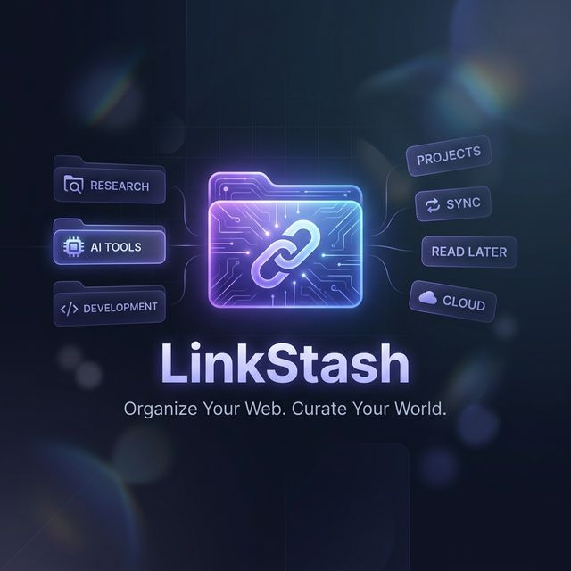

# LinkStash 🚀



### One-line description: Save, organize, and find any link instantly

- **Live Demo**: [https://link-stach.web.app](https://link-stach.web.app)
- **Repo URL**: [https://github.com/KanhaiyaBagul/Link-Stach](https://github.com/KanhaiyaBagul/Link-Stach)
- **Status**: `Completed` 🟢

---

## 🛠️ Tech Stack

| Category | Technologies |
| :--- | :--- |
| **Frontend** | HTML5, CSS3, JavaScript (Chrome Extension MV3) |
| **Backend** | Firebase Auth, Firebase Cloud Messaging |
| **Database** | Firebase Firestore |
| **Deployment** | Chrome Web Store, Firebase Hosting |

---

## 💡 Highlights

### 🔍 What problem does it solve?
Most users struggle with a "bookmark graveyard"—hundreds of saved links that are never revisited because they aren't organized. LinkStash provides a clean, searchable interface to manage your digital resources.

### ⚙️ One interesting technical challenge
Implementing **Real-Time Cloud-Local Synchronization** in Manifest V3. Since service workers are ephemeral, we had to build a robust sync engine that handles state persistence between `chrome.storage.local` and Firestore, ensuring zero data loss and seamless offline support.

### 🌟 Notable Feature: Folder Sharing
Generate unique, shareable URLs for entire folders of links. This allows users to curate resources (like a "Reading List" or "Project Assets") and share them with a single click, bridging the gap between personal bookmarks and collaborative knowledge sharing.

---

## ✨ Full Feature List

- **One-Click Saving**: Context menu and popup triggers.
- **Cross-Device Sync**: Your links, everywhere you are.
- **Smart Search**: Search by title, URL, tags, or folder content.
- **Secure Auth**: Privacy-focused Google and Email sign-in via Firebase.

---

## 🚀 Getting Started

### Installation

1. **Clone the repository**:
   ```bash
   git clone https://github.com/KanhaiyaBagul/Link-Stach.git
   ```

2. **Load the Extension**:
   - Go to `chrome://extensions/`.
   - Enable **Developer mode**.
   - Click **Load unpacked** and select the `/Link-Stach` folder.

3. **Configuration**:
   - Set up your Firebase project and update `background.js` with your config.

---

## 📄 License

MIT © [KanhaiyaBagul](https://github.com/KanhaiyaBagul)
